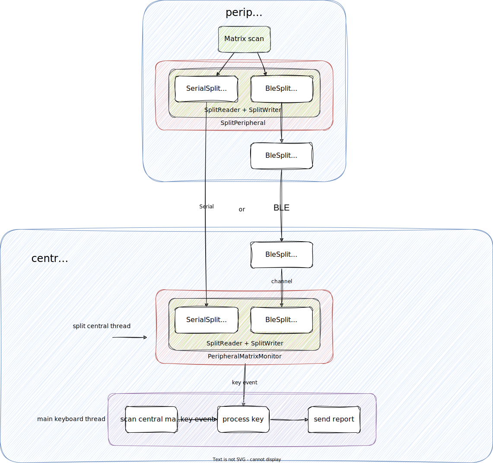

# Split keyboard design

## Overview



## Under the hood

In RMK's current implementation, the peripheral continously scans it's matrix, if there's a key change, A `SplitMessage` is sent to the central.

In central, there's a peripheral monitor for each peripheral, which receives the `SplitMessage` from the peripheral and forwards the key event to keyboard task. 

## Protocol

### Communication protocol

When the central & peripheral talk to each other, the **debounced key states** are sent. The central board receives the key states, converts them to actual keycode and then sends keycodes to the host.

That means the central board should have a full keymap stored in the storage/ram. The peripherals just do matrix scanning, debouncing and sending key states over serial/ble.

A single message can be defined like:

```rust
pub enum SplitMessage {
    /// Key event from peripheral to central
    Key(KeyEvent)
    /// Led state, on/off
    LedState(u8),
}
```


## Config file for split(draft)

Defining a split keyboard should be as simple as a normal keyboard. The split-keyboard's type and matrix should be defined in the `keyboard.toml`.

```toml
# Split keyboard definition(draft)
[matrix]
# Total rows & cols, which should be larger than possible row/col number of all splits
rows = 4
cols = 7
layers = 2

[split]
# Connection type between central & peripherals
connection = "ble"/"serial"

[split.left]
# Pin assignment
input_pins = ["P1_00", "P1_01", "P1_02", "P1_07"]
output_pins = ["P1_05", "P1_06", "P1_03", "P1_04"]

# Number of row/col
# Should be consistent with input_pins & output_pins
row = 4
col = 4
# If it's main, the both offsets default to 0. However, they can be changed
# col_offset = 0
# row_offset = 0

# If the connection type is ble
ble_addr = ""
# If the connection type is uart
uart_instance = ""

[split.right]
input_pins = ["P1_00", "P1_01", "P1_02", "P1_07"]
output_pins = ["P1_05", "P1_06", "P1_03"]

# Number of row/col
# Should be consistent with input_pins & output_pins
row = 4
col = 3

# Offset of row/col of current board
# The total number of rows and cols should not be larger than both sides' row num + row offset
col_offset = 4
row_offset = 0

# If the connection type is ble
ble_addr = ""
# If the connection type is uart
uart_instance = ""

# In case there's multi-split keyboard
[split.top]

# Other fields are same

```

### How to establish the connection?

According to the connection type, some more info should be added. For example, if serial is used, then the serial instance of both central/peripheral should be set in `keyboard.toml`.

If the communication is over BLE, a pairing step has to be done first, to establish the connection between central & peripheral. In this case, the random addr of central and peripheral should be set in `keyboard.toml`, to make sure that central &peripheral can be paired.

### Types of split keyboard

There are several types of split keyboard that RMK should support:

1. fully wired: the left and right are connected with a cable, and the host is connected to left/right with an usb cable
2. fully wireless: the left and right are connected using BLE, and the host is connected using BLE as well
3. dongle like: there is a main device aka dongle, which connected to both left and right using BLE, and the dongle is connected to host by USB. Note that the dongle can be one of left/right side of the keyboard.
4. partial wireless: the left and right are connected with a cable, and the host is connected using BLE

The following is a simple table for those four types of split keyboard

| left/right connection | wired            | wireless       |
| --------------------- | ---------------- | -------------- |
| USB to host           | fully wired      | dongle like    |
| BLE to host           | partial wireless | fully wireless |